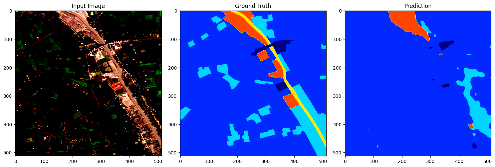
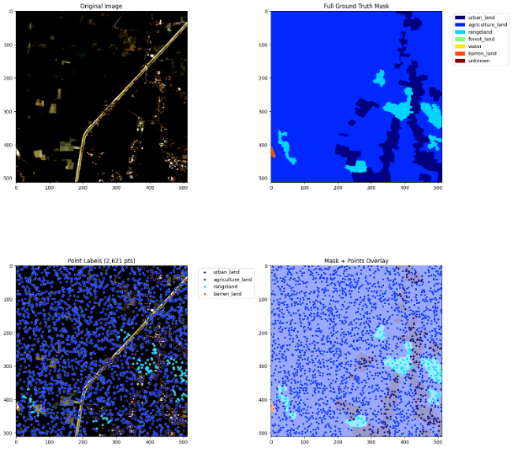
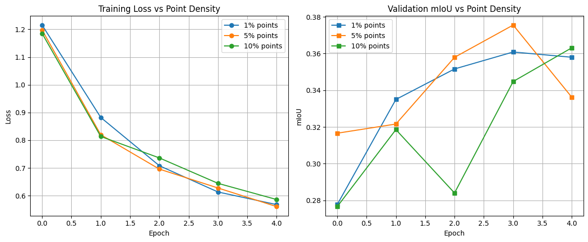
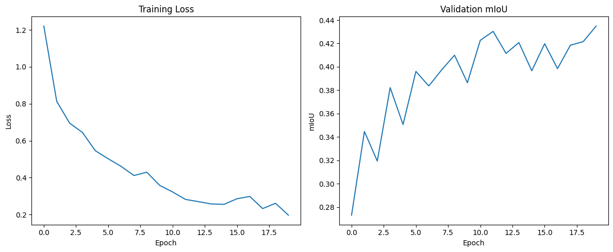

# 🛰️ Remote Sensing Segmentation with Sparse Supervision (PCE Loss)

This project presents a deep learning approach for segmenting satellite images using **Partial Cross-Entropy (PCE) Loss**. The goal is to perform semantic segmentation with minimal annotations, reducing annotation cost while maintaining accuracy.

---

## 📌 Overview

- **Task**: Land cover segmentation from remote sensing images
- **Challenge**: Sparse annotations — only a small subset of pixels are labeled
- **Solution**: Use Partial Cross-Entropy Loss to train on point labels
- **Model**: DeepLabV3+ with a ResNet-50 backbone, modified for sparse supervision

---

## 🗂 Dataset & Preprocessing

- Dataset: [DeepGlobe Land Cover Classification](https://competitions.codalab.org/competitions/18467)
- Images resized to `512x512`
- Converted RGB masks to class indices
- Simulated point labels by randomly sampling pixels

---

## 🧠 Model Architecture

- Backbone: **ResNet-50**
- Segmentation Head: **DeepLabV3+**
- Replaced BatchNorm with **GroupNorm**
- Final classifier adjusted for land cover classes
- Trained with **Adam optimizer** and **PCE Loss**

---

## 🔬 Visualizations

### 🔹 1. Input Image — Ground Truth — Model Prediction

---

### 🔹 2. Sparse Point Annotations & Overlay

---

### 🔹 3. Effect of Label Density on Training

- Training conducted with 1%, 5%, and 10% of labeled pixels
- Slight improvements in mIoU as label density increases

---

### 🔹 4. Training Progress (1% Labels, 20 Epochs)

- Final Validation mIoU: **0.4349**
- Final Loss: **0.1970**

---

## ✅ Key Takeaways

- PCE Loss enables segmentation with limited supervision
- Model generalizes reasonably with just 1% labeled data
- Increasing point density leads to better convergence

---

## 🚀 Future Enhancements

- Save best-performing weights during training
- Implement pseudo-labeling to extend sparse supervision
- Experiment with learning rate schedulers and deeper backbones

---

## 👤 Author

**Mahmoud Mokhiamar**  
📧 mahmoud.mokhiamar@ejust.edu.eg  
🔗 [LinkedIn](https://www.linkedin.com/in/mahmoud-mokhiamar/) | [GitHub](https://github.com/mahmoudmokhiamar)

---
